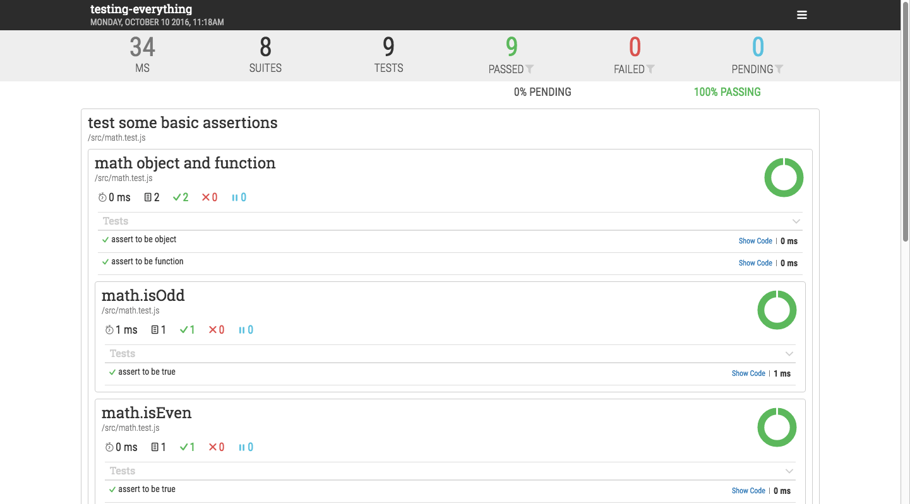

# Unit Testing and TDD Demo

A very simple unit testing and TDD demo with Mocha and Chai. We are just making some basic math operations.

## Running

```sh
npm start    # node src
npm run dev  # nodemon src
```

## Testing

```sh
npm test              # run all tests (src/**/*.test.js)
npm run test:watch    # run test with watch (for TDD/BDD)
npm run test:awesome  # run test with awesome report watch (for TDD/BDD)
npm run test:awesome:live  # run test with awesome report then live-server
npm run test:nyan     # run test with nyan report
npm run test:custom   # run test with custom report
```

## CI

This repo is hooked to Travis CI with `.travis.yml` config. Check out `https://travis-ci.org/mhaidarh/super-mocha-demo`.

### Sample Output

**Spec Report**

```sh
❯ npm test

> testing-everything@1.0.0 test /Users/mhaidarh/All/repo/hacktiv8/phase-2-codes/week-7/testing-everything
> mocha src/**/*.test.js

  test some basic assertions
    math object and function
      ✓ assert to be object
      ✓ assert to be function
      math.isOdd
        ✓ assert to be true
      math.isEven
        ✓ assert to be true

  test some math functions
    isOdd(): should be an odd number
      ✓ with should
      ✓ with expect
    isEven(): should be an even number
      ✓ with should
      ✓ with expect
    isFactorialWith(): expect to be the factorial
      ✓ with expect

  9 passing (20ms)
```

**Awesome Report**


